# Масштабирование приложений
## [Отчет: Кластеризация Flask-приложения (CLUSTERIZATION.md)](./clusterization.md)

## Docker registry for Linux Part 1
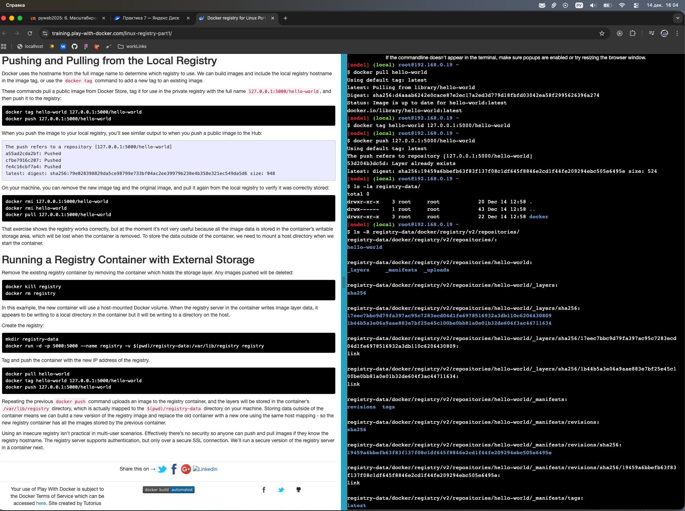

## Docker registry for Linux Parts 2 & 3
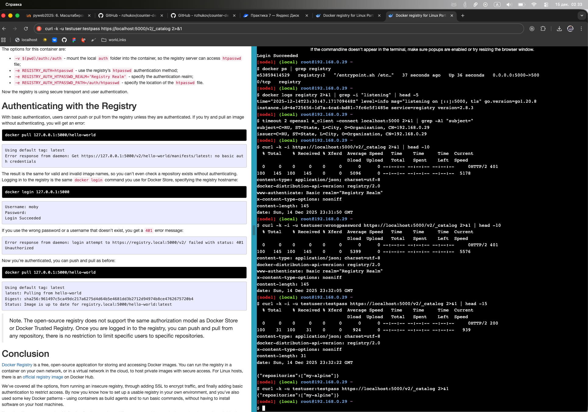
## Docker Orchestration Hands-on Lab
- Все узлы в режиме ACTIVE
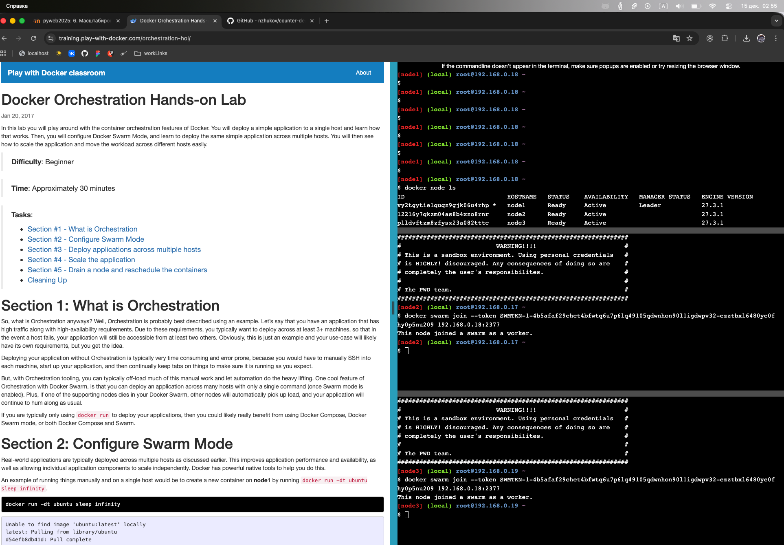
- Распределение сервиса по узлам
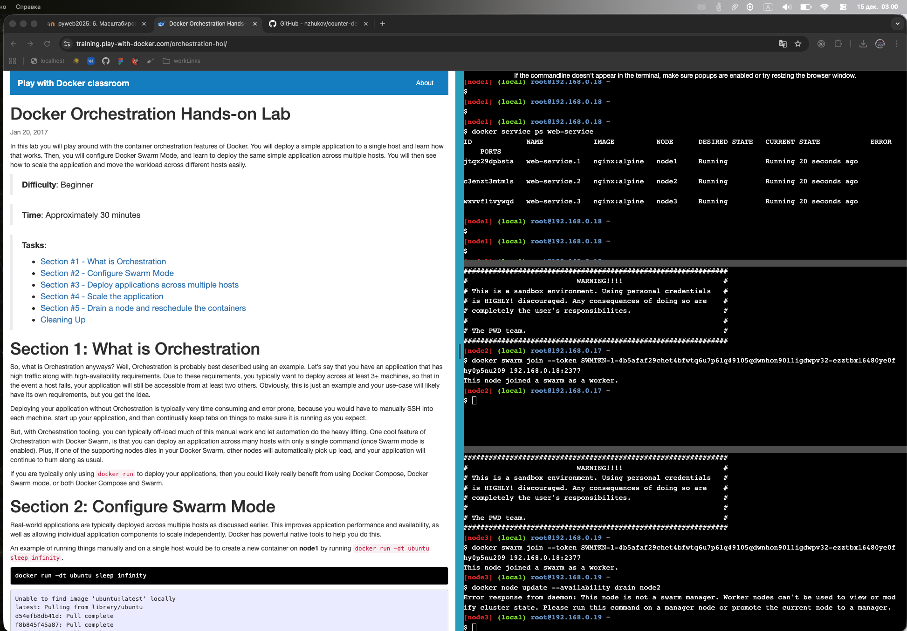
- Узел node2 в режиме DRAIN
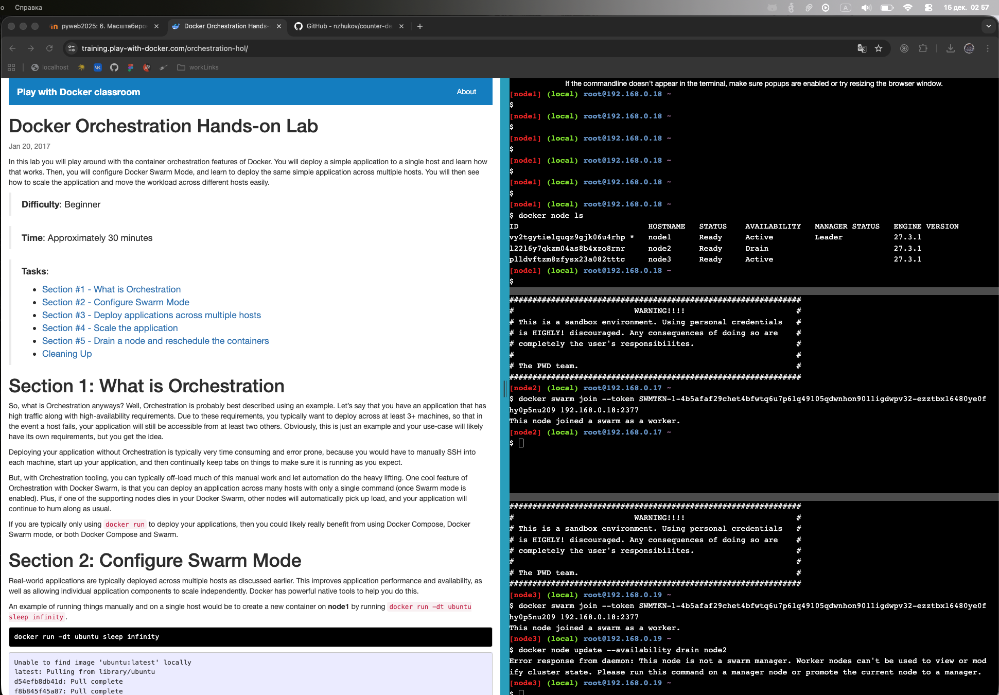
- Перераспределение задач после Drain

- Узел node2 восстановлен в ACTIVE
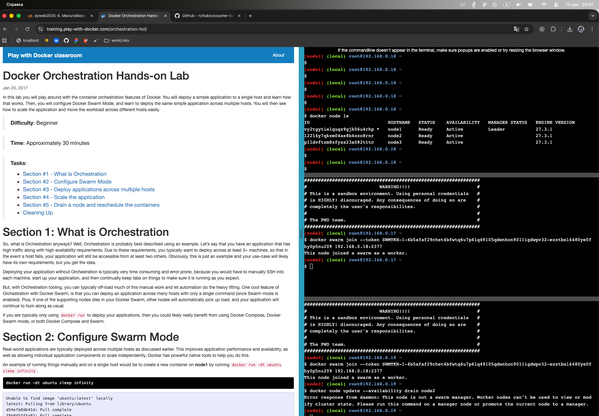
- Состояние задач после восстановления
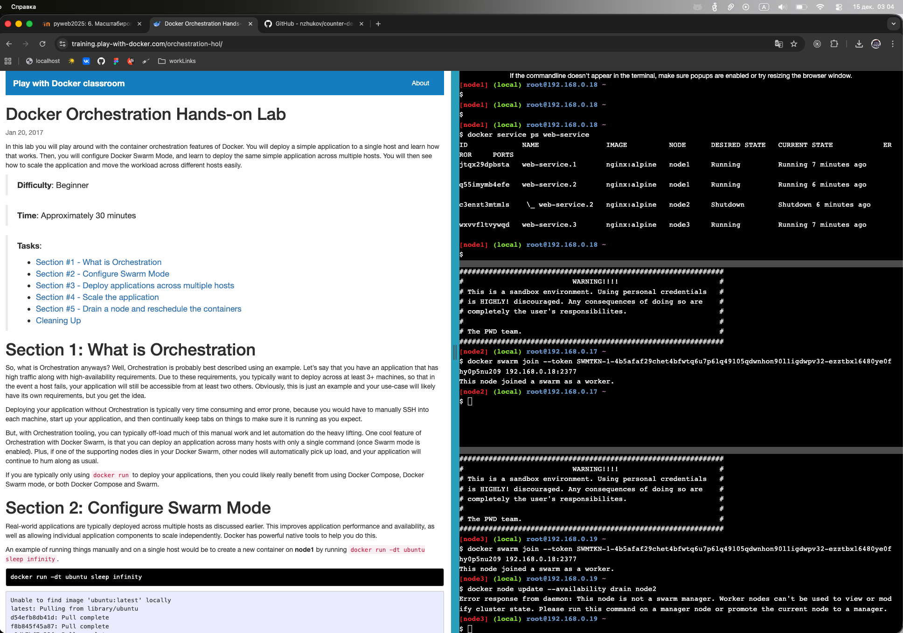

### Восстановилась ли работа запущенного сервиса на этом узле?

**Нет, работа сервиса на узле node2 автоматически НЕ восстановилась.**
- Когда узел переводится обратно в режим `Active`, он становится доступным для **новых** задач
- Однако существующие задачи, которые были перемещены на другие узлы, **остаются там**
- Docker Swarm не выполняет автоматическую ребалансировку задач после восстановления узла
- Это сделано намеренно для обеспечения стабильности работающих контейнеров

### Что необходимо сделать, чтобы запустить работу службы на этом узле снова?
#### **Способ 1: Принудительное обновление сервиса (Force Update)**
bash
```
docker service update --force web-service
```
#### **Способ 2: Масштабирование сервиса**

bash
```
# Увеличить количество реплик
docker service scale web-service=5

# Затем вернуть к исходному значению
docker service scale web-service=3
```

#### **Способ 3: Удаление и повторное создание сервиса**
bash
```
docker service rm web-service
docker service create --name web-service --replicas 3 -p 8080:80 nginx:alpine
```

#### **Способ 4: Использование placement constraints**
bash

```
# Создать новый сервис с привязкой к конкретному узлу
docker service create \
  --name web-worker1 \
  --constraint 'node.hostname==worker1' \
  --replicas 2 \
  nginx:alpine
```

#### **Способ 5: Ручная перебалансировка (Rolling Restart)**

bash
```
# Для каждой задачи выполнить принудительный перезапуск
docker service update --force --update-parallelism 1 web-service
```


## Swarm stack introduction
- Файл где задаются реплики
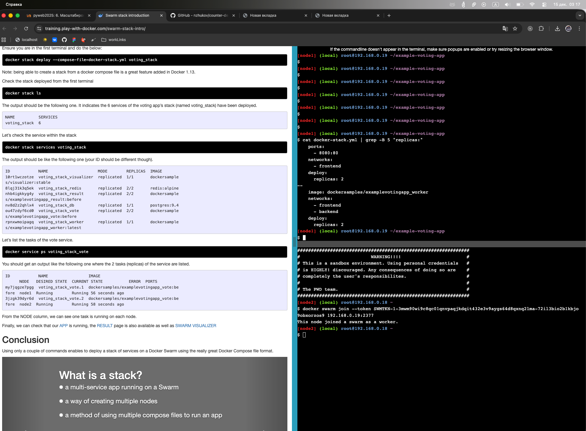
- Развертывание stack
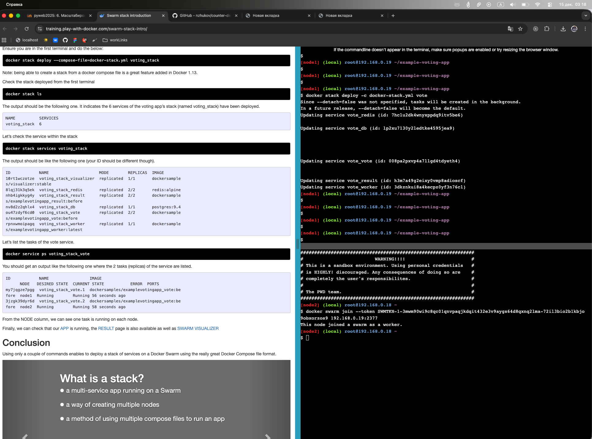
- Количество реплик каждого сервиса
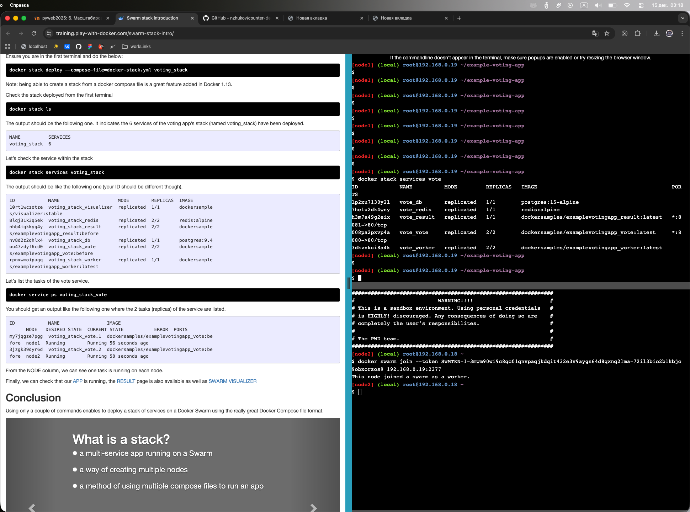
- Детальное размещение по узлам
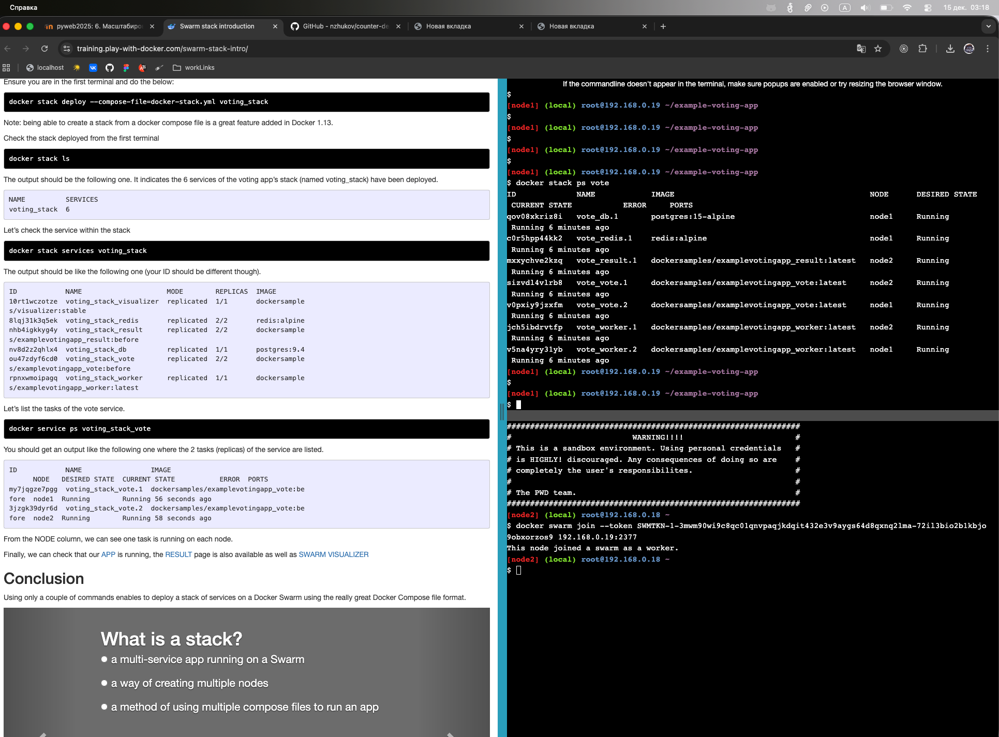
- Добавляем healthcheck
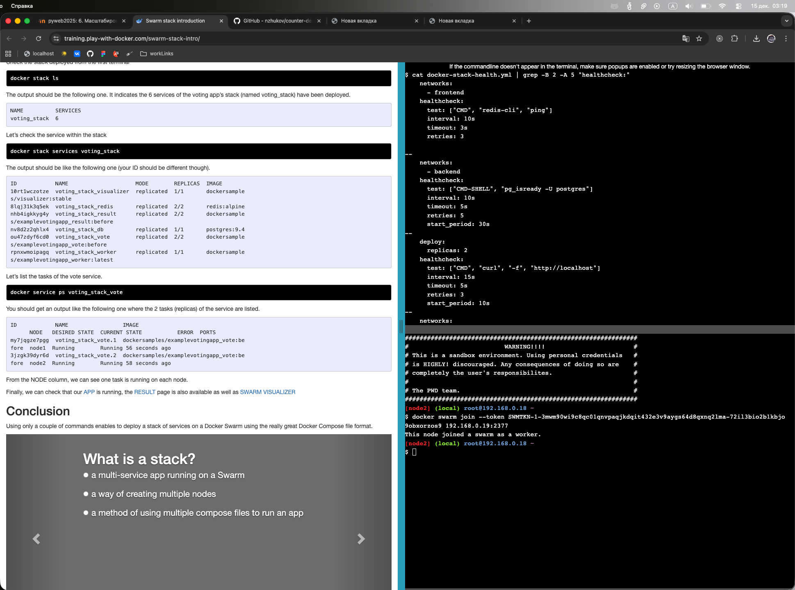

```bash
cat > docker-stack-health.yml << 'EOF'
version: "3.9"

services:

  redis:
    image: redis:alpine
    networks:
      - frontend
    healthcheck:
      test: ["CMD", "redis-cli", "ping"]
      interval: 10s
      timeout: 3s
      retries: 3

  db:
    image: postgres:15-alpine
    environment:
      POSTGRES_USER: "postgres"
      POSTGRES_PASSWORD: "postgres"
    volumes:
      - db-data:/var/lib/postgresql/data
    networks:
      - backend
    healthcheck:
      test: ["CMD-SHELL", "pg_isready -U postgres"]
      interval: 10s
      timeout: 5s
      retries: 5
      start_period: 30s

  vote:
    image: dockersamples/examplevotingapp_vote
    ports:
      - 8080:80
    networks:
      - frontend
    deploy:
      replicas: 2
    healthcheck:
      test: ["CMD", "curl", "-f", "http://localhost"]
      interval: 15s
      timeout: 5s
      retries: 3
      start_period: 10s

  result:
    image: dockersamples/examplevotingapp_result
    ports:
      - 8081:80
    networks:
      - backend
    healthcheck:
      test: ["CMD", "curl", "-f", "http://localhost"]
      interval: 15s
      timeout: 5s
      retries: 3
      start_period: 10s

  worker:
    image: dockersamples/examplevotingapp_worker
    networks:
      - frontend
      - backend
    deploy:
      replicas: 2

networks:
  frontend:
  backend:

volumes:
  db-data:
EOF
```
- Healthcheck контейнера
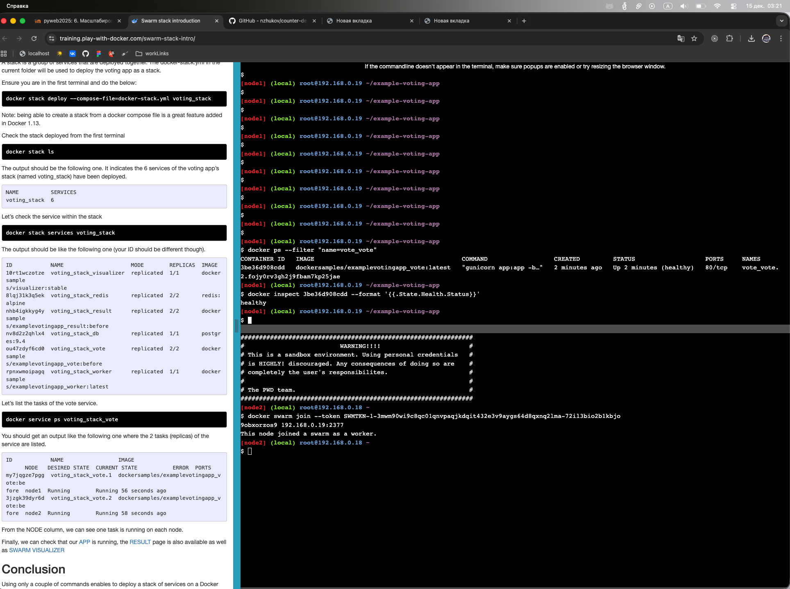
